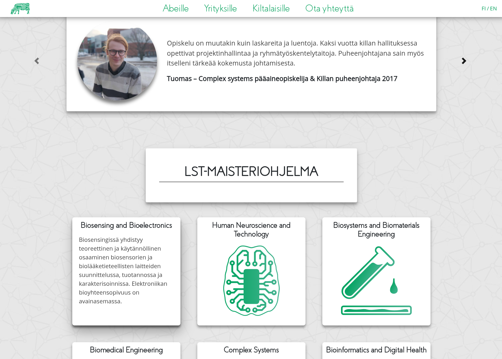

In Aalto University, students from different technical majors organize in
associations – guilds – and the association I considered home is Inkubio.
Everything works via volunteering, including hosting a website about the guild,
its board, officials, events, magazines, history, et cetera. As an aspiring
programmer, the guild website was something I eanted to contribute to.

At that time the website was built with [Drupal](https://new.drupal.org/home),
and it was considered quite a headache. At our guild room, I occasionally heard
the board member responsible for the site lamenting about Drupal Core updates,
taking the site down for days and requiring Sisyphean hacking through the night
to get it running again. Editing the existing pages was cumbersome due to the
way Drupal organized contents, and the theme used wasn't responsive while usage
of internet with mobile phones was ever increasing. We also had an influx of
international students in Aalto, and internationalizing the site in Drupal
seemed an insurmountable task.

Given these preconceptions, I put out a call for a website committee helmed by
I, with the goal of renewing and recreating the website. Over 15 guild members
volunteered to help, and we began work.

## Specification

In order to orient our goals, we started by holding a couple of sessions
dedicated to brainstorming the why of the website: who and what it is for?

We had quite a few meetings discussing our goals, looking at prior art (other
guilds' websites) and drafting the features and information we'd want on the
site. We identified three key demographics: the current members of the guild,
the soon-to-be high school graduates that might want to study bioinformatics,
and companies where students graduating from bioinfo would want to work in.

After finding the common ground on the contents, we started figuring out how to
actually implement them. For an organization of volunteers, we knew that
reducing maintenance overhead and easing administration were top priorities.
Examining the existing options, we settled on
[WordPress](https://wordpress.org/) as we felt that it would best fit our
priorities.

## Development

With our content outlined, we tried to come up with designs that served our
demographics, and what better way to collectively draft them than pen, paper and
sticky notes. We felt that a good way to cater to the three distinct user groups
was to provide each with their own tailor-made page, that would provide them
with relevant information, links and contacts. The exception to this would be
for guild members, who would rather find almost a subsite with distinct
navigation due to the comparatively huge amount of informational pages they
would need.

With the information architecture planned, we continued with drafting visuals
for the different pages. Back then we didn't yet have
[Figma](https://www.figma.com/) or similar easily collaborative design tools,
but many of us were familiar with
[InDesign](https://www.adobe.com/products/indesign.html) from layouting our
guild's magazine, so we used that instead. We tried to keep everything simple,
so that the designs could easily be translated between desktop and mobile.

After some preliminary designs that we were mostly happy with, we started
working on the actual development by trying to get WordPress and a database
running locally. As we had people running Linux, OS X and Windows, it proved to
be quite a hassle, and in the end only few people were confident or comfortable
enough to keep coding with me.

With none of us having proper experience with WordPress development, the
distinction between content and theme wasn't really there. I was too adversarial
against including too many plugins, but as our designs for the front pages
required quite a big deviation from standard document flow, we had a need for
structuring the pages' text a bit more granularly than just with a
[WYSIWYG](https://en.wikipedia.org/wiki/WYSIWYG). I therefore opted to provide
structured text inputs for various UI elements via WP post metadata. This
elegant solution meant that editing many of the pages required dredging through
a list of `<textarea>` elements to figure out where the relevant text could be
found. Maybe [Advanced Custom Fields](https://www.advancedcustomfields.com/)
wouldn't have been so bad after all.

Besides hacking away the theme with [PHP](https://www.php.net/)-laden HTML and
CSS, a bulk of the work included going through the old website's
contents,reorganizing them and restructuring them into our new architecture.
This was mostly conducted in [Google Docs](https://docs.google.com/), which
allowed a large amount of people to contribute. After the restructuring, we
proceeded to translate the contents to english, as practically everything was in
finnish in the old site. Technically, these sites just used the same base
template and the content was input via the WYSIWYG, so at this point everything
was cruising quite smoothly.

At the end of the year, we were finally ready with the content, and with the
last changes getting pushed to the production server just one hour before
midnight on the new year's eve, we managed to accomplish our own goal of having
the new site up and running before the year's end :)

<figure>
    <video
        src="/videos/circuit.webm" autoplay muted loop
        aria-label="Inkubio.fi home page background animation, showing a green circuit board with balls of light tracing the contact surfaces across the board."
    ></video>
    <figcaption>
        Front pages need a little oomph, and this time I tried my hand at some animations for some change from the constant coding.
    </figcaption>
</figure>

## Epilogue

The initial version of the website that got published was well received by the
community, with multiple people helping correct tiny mistakes all around the
site. However, it was still missing some features that we only managed to
implement later on (like applying to volunteer for the guild in an annual call
for volunteers).

For several years, the website continued to fulfill its purpose, although as
more time passed, maintaining the content was starting to yet again be seen as
too daunting for many of Inkubio's volunteers. Some of the new volunteers
started talking about revamping the site once more, and I'd be lying if I said I
didn't also think about it occasionally. I had realized that by rewriting and
storing all the site's contents in weirdly organized WordPress metadata and
WYSIWYG, pretty much none of it would be portable to other platforms unless we'd
just want to reuse the same stored HTML and to completely redo the more complex
pages.

Unfortunately, in 2023,
[the student union decided to stop offering server hosting to associations](https://www.ayy.fi/en/ayy-will-discontinue-associations-website-services).
This meant that the website would be going offline, unless they would be
migrated to another hosting platform. For quite some years, the new volunteers
in the guild had been talking about creating a completely new website, but
progress on it had been slow enough that when the servers went dark, the website
did too and it needed to be replaced with a really quick
[Squarespace](https://www.squarespace.com/) site.
