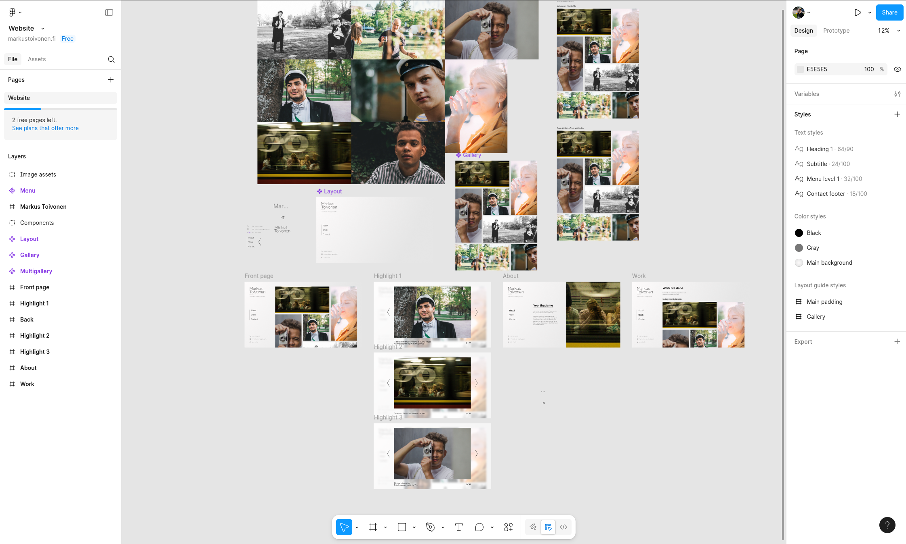

I had long been trying to create a personal website, but that had never come to
fruition due to scope creeps, premature optimizations, procrastination and other
similar novel problems.

With all the staying home due to COVID-19, I wanted to work on some projects
that I'd been procrastinating on for a long time, such as a personal website.
What better way then to start a project than to dive in to completely another
one, a personal website for a friend :)

Markus had long been the go-to guy for photographing most of the events of our
student guild, Inkubio, and recently also had started doing photography gigs as
a freelancer. He had held the domain for his name for some time, but hadn't
gotten around to setting up a portfolio other than his Instagram. At some point
I had promised to create him one to brush up my skills, in exchange for a photo
gig at a later time.

For this project, the guidelines were quite open, as Markus only wanted a
"minimal website with a focus on the photos". He sent me some other portfolio
sites for inspiration, and I sketched up a draft of the visual layout for him to
review in Figma. He also wished for the site to be bilingual, which was a
challenge I gladly accepted.

I figured that for him to easily be able to add and edit content on his site,
I'd need some kind of a content management system (CMS). Witha sour taste from
WordPress from prior projects, I had been eyeing up some of the newcomers in the
space for headless (i.e. content frontend agnostic) CMS's, namely Strapi and
Directus. For another completely unrelated project, I had tried a bit of Strapi,
but it had left me quite lukewarm. I was also intrigued by Directus' philosophy
of retaining control of the database, as
[Directus works with just normal database tables](https://docs.directus.io/getting-started/architecture.html)
(unlike
[Strapi, which locks you in to their custom database schema](https://docs.strapi.io/cms/configurations/database),
of which I'd already had enough of with WordPress),

For the website itself, I wanted to try out [Next.js](https://nextjs.org/), as
it seemed a good fit for mostly static content with the photos, while allowing
for neat interactivity with the gallery views. The site itself was quite simple,
but the wish for bilingual content required some deep thought for both the data
model and the frontend architecture. Localized URLs, i.e. `/gallery` in english
vs. `/galleria` in finnish, were the biggest hurdle as there weren't any
packages for Next.js that I could find with this functionality. This led to a
hacky solution with a single catch-all route that was used to query the URL from
Directus to find the matching page which, thanks to Next.js' incremental static
rendering and `getStaticPaths()`, wasn't such a bad option for performance.

For a small personal project, there was no need for a high-end hosting setup, so
we went for the smallest virtual machine available from
[Hetzner](https://www.hetzner.com/). During development, the database, Directus,
Next.js and [nginx](https://nginx.org/) were running in
[Docker](https://www.docker.com/) with
[compose](https://docs.docker.com/compose/), which after a bit of testing seemed
to work just fine for the actual deployment too. This ensured that the ongoing
costs for the whole thing would stay in just a few euros per month, without
needing to worry too much about bandwidth or storage limits when hosting high
quality photos.
