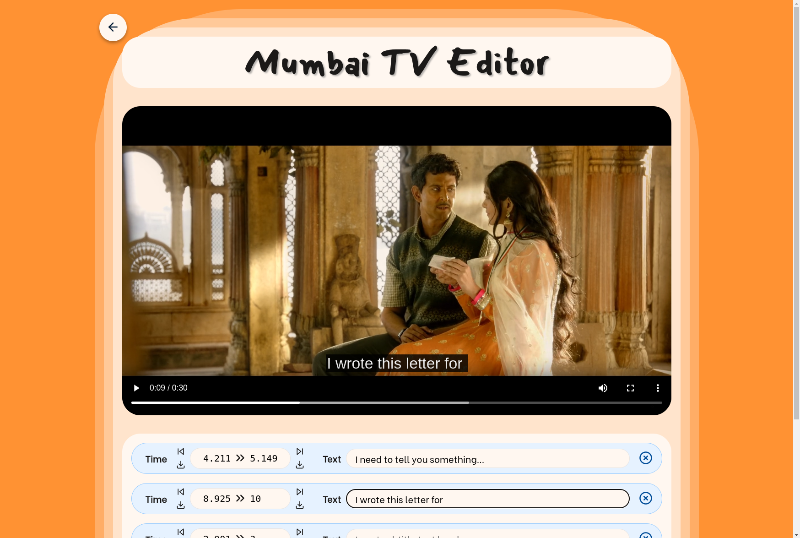

There was a time when the best content on the internet wasn't engineered around
the algorithmic attention economy of dystopic social media giants, rather it was
found in small independent pockets distributed via word of mouth. Bombay TV was
one of the latter.

The platform was a simple flash applet with predetermined clips from obscure
Bollywood movies, with text inputs for writing your own subtitles for whatever
the actors were saying on the screen and a link for sharing your creation. This
enabled the expression of broad and inside jokes, and was wildly popular, at
least among a group of biotech students.

All good things come to an end, however, and as the support for Flash in
browsers steadily declined and using the site became increasingly difficult, the
platform was eventually shut down in 2021. Some time before the official
shutdown, I decided to try and create a modernized version to reignite the
culture of elaborate shitposting among our fellow students.

As I wanted to create the initial version as fast as possible, I couldn't be
bothered writing a backend as it would complicate the hosting (i.e. no free
[Vercel](https://vercel.com/) deployments). The only state that would need to be
shared were the subtitles for a given video, and as the main distribution
channel would be just sharing links, I came up with the idea of storing all the
subtitle data in an URL query parameter.

Simplest way I found for showing users subtitled video was to use the
[HTML `<video>` element](https://developer.mozilla.org/en-US/docs/Web/HTML/Element/video)
with
[WebVTT subtitles](https://developer.mozilla.org/en-US/docs/Web/API/WebVTT_API/Web_Video_Text_Tracks_Format).
Due to the simplicity of the base format, it was easy enough to populate the
editor on page load, which hopefully encouraged users to experiment with their
own subtitlings.

Sadly, that was perhaps the only successful way of helping the content creators
with subtitling, as I was never quite happy with how the interface for adding
new lines of text with millisecond timings worked. The interface allowed for
manually typing timestamps and additionally setting them based on the current
timestamp in the video player, but neither of these were ergonomic enough in
retrospect. The ideal solution would have been to provide preset subtitle
timestamps for each video clip, but due to having large enough selection and
little enough skills for automatic timestamping based on some signal processing
approach (or patience for hand-crafting the timestamps), this was never
implemented.

After enjoying some success in the student community, the noisiness of long,
long URLs in [Telegram](https://telegram.org/) chats was starting to hurt my
soul, so I finally caved in and implemented a stateful "URL shortener" for
sharing links to the subtitled clips that could fit on a single line of chat
bubble text. [MongoDB](https://www.mongodb.com/) offered a sufficiently generous
free tier that allowed for a simple key-value based storage of user-created
subtitles, that would be fetched instead of parsing the query string if not
provided.

After a while, most of the available nostalgia had been extracted from
mumbaitv.online, and after falling off the guild's zeitgeist, I couldn't be
bothered with renewing the domain causing the site to fall offline.
