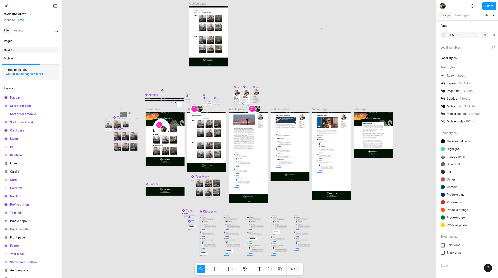

In the spring of 2021, a friend of mine was volunteering for the annual ball
committee of [Aalto University's](https://www.aalto.fi/) Industrial Engineering
and Management's (IEM) student guild [Prodeko](https://prodeko.org/). The guild
has a tradition of hosting a seminar for students and alumni alike on the same
week as the ball, and this year they got an idea for a web platform that would
facilitate the event with talks, blogs, podcasts and discussions. The friend had
seen me develop [our guild's website](/projects/inkubio-fi) and other small projects (such as [Kiltisbot](/projects/kiltisbot))
and knew of my related work experience, so they asked me if I was available for
contracting such a platform.

Naturally I accepted; this presented me with a great opportunity for learning,
as I had previously only worked as a software consultant/contractor as a part of
a team, with an agency managing large parts of the customer interactions.

## Requirements

Luckily for me, the customer – a joint group from both Prodeko and the
[Aalto department of IEM](https://www.aalto.fi/en/department-of-industrial-engineering-and-management)
– had quite clear vision and requirements for the platform. It needed to
support:

- text, audio and video content;
- internationalization of the content (at least finnish and english);
- content administration by non-technical users;
- full-text search of the content;
- likes and comments for the content and
- authentication for commenting with pre-existing OAuth2 infrastructure.

Most of these I already had experience with but others, like full-text search, I
hadn't implemented before. After discussing the details with the client, I gave
them a quote which included a quick design sprint at the start to hone the
overall layout and visuals of the website. They accepted, and I was off to the
races.

## Design sprint

As there were no proper designs for the platform yet, rather individual design
elements such as logos and banners, I felt the need to propose some visual
drafts right before starting to work on the application itself. I created an
initial design using [Figma](https://www.figma.com/), implementing basic
interactivity like navigation and mock commenting to better pitch what I had in
mind. There were few guidelines besides supporting the pre-existing assets, so I
focused on creating a simple UI with focus on the content itself. This would
also lend itself to reusing the platform on later years with simply just
replacing colors, banners and similar assets.

After I was done with the initial design I demoed it to the clients, asking for
comments. They mostly consisted of changes to specific words used, as they were
quite satisfied with the presented visuals and functionality. After a round of
refining, based on comments received, I started the proper development.

## Development

As the schedule and budget for the project were really tight, there was no way
of creating everything from scratch (without even considering the infeasibility
anyways). It was therefore essential to try to utilize as many open-source
building blocks as possible.

Starting with the largest component, the Content Management System (CMS), the
main contenders were [Strapi](https://strapi.io/) and
[Directus](https://directus.io/) due to their great customizability. Both seemed
to enjoy wide popularity and support a wide variety of features out of the box,
but the deciding factor was Directus' better support for internationalization,
with the added bonus of philosophical purity for the CMS to actually store your
data in sane tables with the potential of ejecting the data whenever, whereas
Strapi is not schema-agnostic and requires specific table layouts to work.

For implementing the full-text search, I initially attempted to use
[Elasticsearch](https://www.elastic.co/elasticsearch), as it seemed to be the
industry standard tool. However, the documentation proved to be quite obtuse and
the solution itself quite heavyweight for such a small site, so after
considering other options I ended up using
[MeiliSearch](https://www.meilisearch.com/). Again, using
[Directus' extensions](https://directus.io/docs/guides/extensions/overview), a
small hook script was sufficient for syncing the CMS' contents into the search
index. In addition, the extension system provided a great way for integrating
the existing guild authentication.

The only thing Directus was really missing in my opinion were automatic schema
and data migrations that could be versioned alongside code. The value of schema
migrations should be self-evident, and in Directus' case where quite a few
configurations are stored in the database (such as editor UI layouts and content
permissions), so being able to version those without manually writing SQL
migrations would've been helpful. There has been
[quite a lot of discussion on this on Github](https://github.com/directus/directus/discussions/3891)
and apparently schema migrations now exist natively, but it seems that data
migrations are still missing.

For the frontend, [Next.js](https://nextjs.org/) seemed like the obvious choice
due to the mostly static nature of the website, with easy support for dynamism
when needed. Creating the frontend was quite uneventful; following the
self-drawn design and having thought out what components made sense in Figma
already made the process a breeze. The most complex feature was handling
localized URLs (e.g. `/blog/hello-world` for english and `/blogi/hei-maailma`
for finnish), and I wasn't entirely happy with how the only way to accomplish
this in Next.js seemed to be semi-custom route handling with a catch-all route,
but an ugly working solution is better than a beautiful theoretical one.
Completing the UI well within schedule, I put in the extra effort to add some
flourish for the users that would "like" a submission on the site.

")

## Completion

As the project neared completion, I started working on the deployment of the
components. Prodeko was already running their infrastructure on virtual machines
(VMs) and Docker containers, so I wrote scripts that could be run to easily
deploy and update the project on the VMs. We deployed the site, and the client
started adding blog posts, videos and podcasts to the site. I wrote
documentation for maintaining the code and contents to the best of my abilities,
and after the clients reviewed them we considered the project completed.

It seemed to me that the client was well satisfied with the results, and I was
glad to have been able to complete everything within the agreed schedule. I
learned a great deal about how to manage such a project when working mostly solo
and how to communicate with stakeholders before, during and after a project. I
also got to challenge myself with novel technologies, which is always a plus :)
